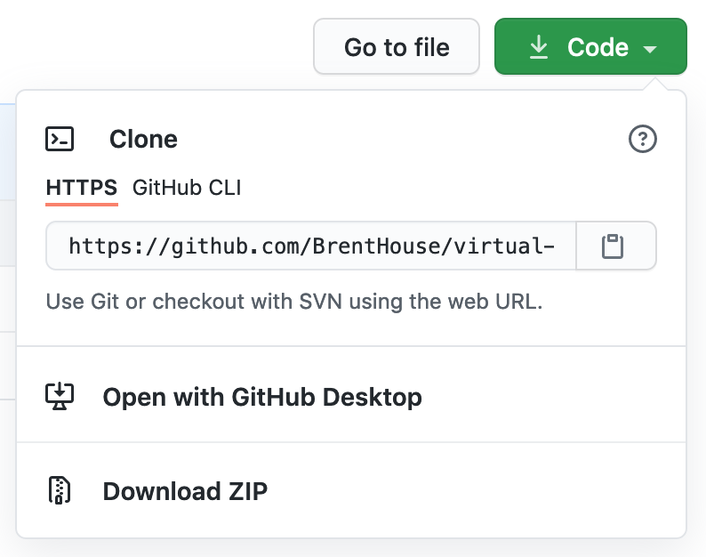

# Virtual Compline @ Brent House
## *Te Lucis ante Terminum* Polyphony Recording

[![CC-BY-4.0][cc-by-4.0-image]][cc-by-4.0]

For the [Virtual
Compline](https://brenthouse.philipmcgrath.com/compline-2021-06-09.html)
service at [Brent House](https://brenthouse.org) at UChicago, to
supplement the music we’ll sing live on Zoom, we are recording polyphony
by Thomas Tallis for the middle verse of *Te Lucis ante Terminum*.

We hope you will virtually sing with us!

### How to Participate

 1. Click on the `Code` button (near the top of [this
    page](https://github.com/BrentHouse/virtual-compline-te-lucis-polyphony/)),
    then click `Download ZIP`:
  
    
    
    (If you use Git, fork and clone this repository, instead.)
    
 2. If you don’t already have Audacity, or if you don’t have at least
    version 3, [download and install
    it](https://www.audacityteam.org/download/).
 
 3. Learn the music. There is a score in
    [`Te-Lucis.pdf`](./Te-Lucis.pdf).
 
    Open `Te-Lucis.aup3` with Audacity to listen to everything we have
    so far.
 
    Notice that the recordings play the part labeled `Cue` as an
    introduction, to give you the pitch and tempo.
 
 4. When you’re ready, record yourself singing a part. Use Audacity’s
    [`Record New
    Track`](https://manual.audacityteam.org/man/recording.html#newtrack)
    function.  Make sure to wear headphones so your microphone doesn’t
    get feedback from the recordings that are already there.
 
    If you need help, email
    [philip@brenthouse.org](mailto:philip@brenthouse.org) or look at
    [this
    tutorial](https://manual.audacityteam.org/man/overdubbing_using_your_computer_s_on_board_sound_card.html).
    
 5. Listen to your recording and make sure you’re happy with it. You can
    always delete your track and record a new one.
 
 6. You can record more than one part, if you’d like—maybe you want to
    sing all five!
 
 7. When you’re done, save the project **and quit Audacity.** It is very
    important that you have closed Audacity before moving on to the next
    step!
 
 8. Send the file `Te-Lucis.aup` to
    [philip@brenthouse.org](mailto:philip@brenthouse.org).
 
    (If you use Git, make a pull request, instead. Note that, if you
    commit a file called `Te-Lucis.aup3-wal`, you forgot to **quit
    Audacity.** Don’t worry about any merge conflicts.)
    
 9. I will combine all of the recordings and include them in the [order
    of
    service](https://brenthouse.philipmcgrath.com/compline-2021-06-09.html).
 
 **Thank you!**

[cc-by-4.0]: https://creativecommons.org/licenses/by/4.0/
[cc-by-4.0-image]: https://mirrors.creativecommons.org/presskit/buttons/80x15/svg/by.svg
